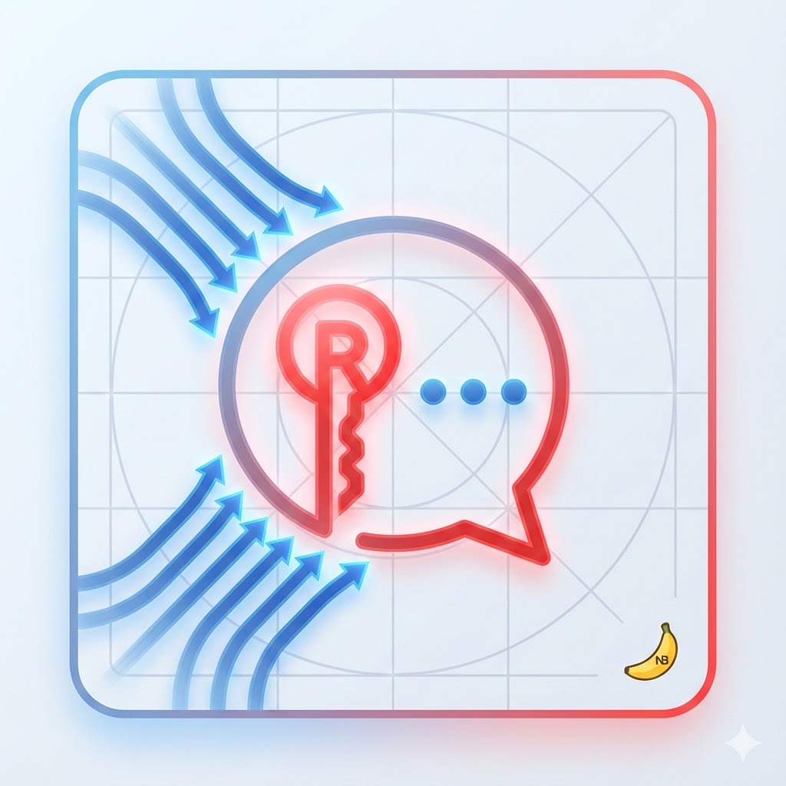

<div align="center">

  
  <h1>RC-Application</h1>
  
  <p>
    A structured, quality-driven Redis GUI client built with rigourous planning, testing, and documentation in mind.
  </p>

<p>
  <a href="https://github.com/petru-braha/RC-application/graphs/contributors">
    
  </a>
  <a href="">
    
  </a>
  <a href="https://github.com/petru-braha/RC-application/network/members">
    
  </a>
  <a href="https://github.com/petru-braha/RC-application/stargazers">
    
  </a>
  <a href="https://github.com/petru-braha/RC-application/issues/">
    
  </a>
  <a href="https://github.com/petru-braha/RC-application/blob/master/LICENSE">
    
  </a>
</p>
   
<h4>
    <a href="./doc/demo.mp4">View Demo</a>
  <span> · </span>
    <a href="./doc/requirements.md">System requirments</a>
  <span> · </span>
    <a href="https://github.com/petru-braha/RC-application/issues/">Report Bug</a>
  <span> · </span>
    <a href="https://github.com/petru-braha/RC-application/issues/">Request Feature</a>
  </h4>
</div>

---

## ✨ Features

Main development time: 02.12.2025 - 06.01.2026

- **Modern UI**: A responsive desktop and web interface built with **Flet**.
- **Non-Blocking Architecture**: High-performance network layer using the **Reactor Pattern** for efficient I/O multiplexing.
- **Protocol Versatility**: Full support for **RESP2** and **RESP3**, including automatic version negotiation and smart handshakes.
- **Connection Management**: Scalable management for up to **1024 concurrent connections**, each with its own isolated command history.
- **Flexible Connectivity**: Connect using standard **Redis URLs** or detailed manual configuration.
- **Conversational Interface**: Interaction with Redis instances via a clean, chat-inspired dialogue view.
- **Smart Data Handling**: Efficient byte-level buffering and decoding tailored for Redis payloads.
- **Infinite Scrolling**: Optimized list views for browsing many connections and deep command histories.

### 📷 Screenshots

<div style="display: grid; grid-template-columns: 1fr 1fr; justify-content: center; gap: 20px;"> 


</div>

---

## 🛠 Build Instructions

Ensure you have **Python 3.10+** and **pip** installed on your system. See more [here](https://pip.pypa.io/en/stable/installation/).

### Automated Setup

The quickest way to get started is by using the provided installation script, which handles virtual environment creation and dependency installation:

```bash
./bin/install.sh
```

### Manual Setup

If you prefer a manual installation, follow these steps:

1. **Create a virtual environment:**
   ```bash
   python3 -m venv .venv
   ```
2. **Activate the environment:**
   ```bash
   source .venv/bin/activate
   ```
3. **Install dependencies:**
   ```bash
   pip install -r requirements.txt
   ```

### Execution

To launch the application, run:

```bash
# For CLI mode.
python3 src/main.py

# For GUI mode.
flet run
```

See more about flet requirements [here](https://docs.flet.dev/getting-started/installation/).

---

## 🎯 Development Philosophy

This project is intentionally structured and documented to maintain high standards.  
Testing is as important as source code, a TDD approach is envisioned.  
Documentation too.  
Branches remain organized and purpose-driven.

---
